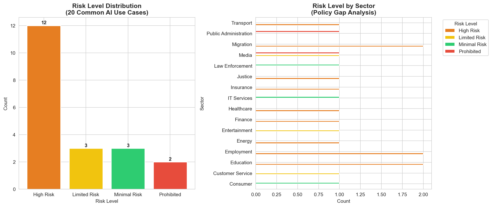

<div align="center">

# ⚖️ EU AI Act Compliance Classifier

### An open-source tool that classifies AI systems according to EU AI Act risk levels and generates actionable compliance recommendations.

[](https://python.org)
[](https://share.streamlit.io)
[](LICENSE)
[](https://eur-lex.europa.eu/legal-content/EN/TXT/?uri=CELEX:32024R1689)
[](https://xgboost.readthedocs.io)
[](https://github.com/jayeshranghera/eu-ai-act-compliance-classifier)

<br>

> *"60% of common AI use cases fall under High Risk or Prohibited categories — yet most organisations remain unaware of their compliance obligations."*

<br>



</div>

---

## 📌 Problem Statement

The **EU AI Act** (Regulation 2024/1689) is the world's first comprehensive AI regulation. Full enforcement begins **August 2026**. Yet the Act is **100+ pages of complex legal language** — making compliance assessment inaccessible for most companies.

**Who is affected?**
- 🇮🇳 Indian IT companies building AI products for EU clients
- 🇪🇺 EU startups deploying AI systems
- 🏢 Small firms with no dedicated legal or compliance team
- 🔬 Researchers and policy analysts studying AI governance

**The gap:** Large firms hire expensive consultants. Everyone else remains non-compliant by default.

**This tool bridges that gap — for free.**

---

## 🎯 Solution

Input any AI system description → get instant:

| Output | Description |
|--------|-------------|
| 🔴🟠🟡🟢 **Risk Level** | Prohibited / High Risk / Limited Risk / Minimal Risk |
| 📋 **Legal Reference** | Exact Annex I / Annex III category |
| ✅ **Compliance Requirements** | Article-by-article checklist |
| ⏰ **Deadline** | When compliance is mandatory |
| 📖 **Legal Sections** | Relevant EU AI Act text retrieved via RAG |

---

## 🏗️ Project Architecture

```
eu-ai-act-compliance-classifier/
│
├── data/
│   ├── raw/                        # AIID dataset (incidents, reports)
│   ├── processed/                  # Labeled dataset, analysis outputs
│   └── knowledge_base/             # EU AI Act PDF (official source)
│
├── notebooks/
│   ├── 01_data_exploration.ipynb   # EDA — 514 AI incidents
│   ├── 02_preprocessing.ipynb      # Text cleaning + EU AI Act labeling
│   ├── 03_model_training.ipynb     # ML model training + evaluation
│   └── 04_rag_pipeline.ipynb       # RAG pipeline + compliance reports
│
├── models/
│   ├── best_model.pkl              # XGBoost classifier
│   ├── tfidf_vectorizer.pkl        # TF-IDF vectorizer
│   ├── label_encoder.pkl           # Label encoder
│   ├── rag_vectorizer.pkl          # RAG TF-IDF index
│   └── rag_chunks.pkl              # 529 EU AI Act chunks
│
├── app/
│   └── app.py                      # Streamlit dashboard (3 pages)
│
├── policy_brief/                   # Policy analysis outputs
├── requirements.txt
└── README.md
```

---

## 🔬 Technical Stack

| Layer | Technology | Purpose |
|-------|-----------|---------|
| **Data** | AIID Dataset (514 incidents) | Real-world AI failure cases |
| **NLP** | TF-IDF, Bigrams, stopword removal | Text feature extraction |
| **ML Model** | XGBoost Classifier | Risk level classification |
| **RAG** | TF-IDF + Cosine Similarity | Legal section retrieval |
| **Knowledge Base** | EU AI Act PDF (144 pages, 529 chunks) | Grounded legal context |
| **Dashboard** | Streamlit | Interactive compliance tool |
| **Deployment** | Streamlit Cloud | Live public access |

---

## 📊 Model Performance

| Model | Accuracy | F1 Score | Precision |
|-------|----------|----------|-----------|
| Logistic Regression | 65.0% | 0.651 | 0.675 |
| Random Forest | 61.2% | 0.594 | 0.751 |
| **XGBoost** ✅ | **69.9%** | **0.690** | **0.707** |

**5-Fold Cross-Validation:** Mean Accuracy = **71.98%** | Std Dev = 0.035 *(Stable)*

**Classification approach:** Hybrid — Rule-based classifier (Annex I + III keywords) with XGBoost fallback for ambiguous cases.

---

## 🔑 Key Policy Findings

> Based on analysis of **514 real-world AI incidents** and **20 common AI use cases**

```
📊 Risk Distribution (20 Common AI Use Cases)
━━━━━━━━━━━━━━━━━━━━━━━━━━━━━━━━━━━━━━━━━━━━
🟠 High Risk    ████████████████████████  60%  (12/20)
🟢 Minimal Risk ███████████░░░░░░░░░░░░░  15%  (3/20)
🟡 Limited Risk ███████████░░░░░░░░░░░░░  15%  (3/20)
🔴 Prohibited   ███████░░░░░░░░░░░░░░░░░  10%  (2/20)
━━━━━━━━━━━━━━━━━━━━━━━━━━━━━━━━━━━━━━━━━━━━
```

| Sector | Non-Compliance Rate |
|--------|-------------------|
| Education | 100% |
| Healthcare | 100% |
| Law Enforcement | 100% |
| Finance | 92.3% |
| Employment | 82.6% |
| Transport | 72.4% |

**Key Insight:** Indian IT companies exporting AI products to EU clients — particularly in HR tech, fintech, and healthtech — face significant compliance exposure ahead of the August 2026 deadline.

---

## 🚀 Quick Start

### 1. Clone the repository
```bash
git clone https://github.com/jayeshranghera/eu-ai-act-compliance-classifier.git
cd eu-ai-act-compliance-classifier
```

### 2. Install dependencies
```bash
pip install -r requirements.txt
```

### 3. Run the dashboard
```bash
streamlit run app/app.py
```

### 4. Run notebooks (optional)
```bash
cd notebooks
jupyter notebook
```
Run in order: `01` → `02` → `03` → `04`

---

## 📋 EU AI Act Risk Framework

| Risk Level | Legal Basis | Examples | Deadline |
|-----------|-------------|---------|----------|
| 🔴 **Prohibited** | Annex I | Social scoring, mass biometric surveillance, deepfake manipulation | **Immediate** |
| 🟠 **High Risk** | Annex III | Hiring AI, credit scoring, medical diagnosis, court sentencing, autonomous vehicles | **Aug 2026** |
| 🟡 **Limited Risk** | Article 52 | Chatbots, recommendation systems, AI-generated content | **Aug 2026** |
| 🟢 **Minimal Risk** | — | Spam filters, music recommendations, smart home assistants | None |

---

## 📁 Dataset

| Source | Description | Size |
|--------|-------------|------|
| [AI Incident Database (AIID)](https://incidentdatabase.ai) | Real-world AI failures and incidents | 514 incidents |
| [EU AI Act PDF](https://eur-lex.europa.eu/legal-content/EN/TXT/?uri=CELEX:32024R1689) | Official regulation text | 144 pages, 529 chunks |
| Manual seed labels | 20 hand-labeled AI systems (Annex I + III) | 20 examples |

---

## 🗂️ Notebooks Overview

| Notebook | Description | Key Output |
|----------|-------------|-----------|
| `01_data_exploration` | Load, inspect, and visualize AIID dataset | `merged_raw.csv` |
| `02_preprocessing` | Text cleaning, EU AI Act labeling, sector classification | `labeled_dataset.csv` |
| `03_model_training` | TF-IDF features, 3 models, XGBoost best model | `best_model.pkl` |
| `04_rag_pipeline` | PDF extraction, chunking, retrieval, compliance reports | `rag_chunks.pkl` |

---

## 🎯 Target Audience

This tool is built for:

- **Compliance teams** at companies deploying AI in European markets
- **Indian IT firms** (TCS, Infosys, Wipro) building AI for EU clients
- **Startups** that cannot afford legal consultants
- **Policy researchers** and think tanks studying AI governance
- **Regulators** needing a reference tool for risk classification

---

## 👤 Author

**Jayesh Ranghera** — Applied AI Policy & Governance Analyst

[](https://linkedin.com/in/jayeshranghera)
[](https://github.com/jayeshranghera)
[](https://jayeshranghera.github.io)

*MA Political Science | IBM Data Science Professional | EU AI Act Researcher*

---

## 📄 License

This project is licensed under the MIT License. See [LICENSE](LICENSE) for details.

---

## ⚠️ Disclaimer

> This tool is for **informational and research purposes only** and does not constitute legal advice. For formal compliance assessment, consult a qualified legal professional.

---

<div align="center">

**⭐ If this project helped you, please star the repository.**

*Built with ❤️ to make EU AI Act compliance accessible to everyone.*

</div>
